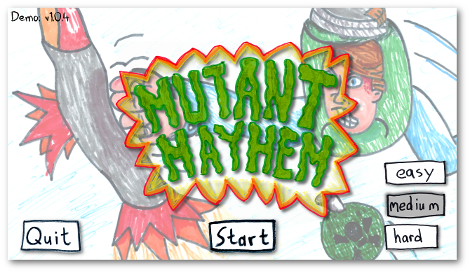

# Mutant Mayhem
Implementing Mutant Mayhem, a game in the syle of Octogeddon, in Godot. 

## Background
I have two kids that are really big fans of the game Octogeddon available on PC and Nintendo Switch. However, there is no Android version of this game available, so I thought it'd be a fun project for us to try to make a game in a similar style. 

I've been a programmer (both amateur and professionally) for most of my life and thought this might be a fun opportunity to put my skills to use. My language of choice is C#, so combined with the amazing Godot Engine, this seemed like a good fit. 

My kids came up with most of the story and artwork (and I helped out where necessary) and together, we discovered the awesome music of [Komiku](https://loyaltyfreakmusic.com/) Komiku. The music was a perfect fit for the art/gameplay we came up with...so off we went. We spent countless hours during the pandemic plugging away, and are generally happy with the results.

